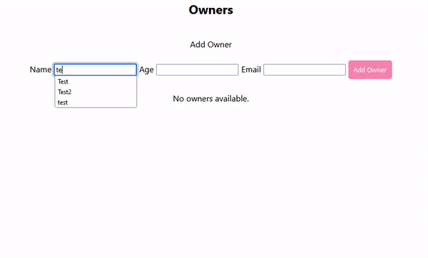

# Full Stack MongoDB, Mongoose, Node.js, and React Demo

This is a very simple full-stack demo using MongoDB, Mongoose, Node.js, and React. The demo features a basic implementation of CRUD operations for managing owners, showcasing how to connect a Node.js backend with a MongoDB database and interact with the data through a React frontend.



## Prerequisites

To run this demo locally, ensure you have the following installed:

- [Node.js](https://nodejs.org/)
- [MongoDB](https://www.mongodb.com/docs/manual/installation/)

You will also need to have a local MongoDB server running.

## Getting Started

### Step 1: Running MongoDB Locally

To run MongoDB on your localhost:

1. Install MongoDB if you haven’t done so already.
2. Open a terminal and run the following command to start MongoDB:

   ```bash
   mongod
   ```

   By default, MongoDB runs on `mongodb://127.0.0.1:27017`.

### Step 2: Setup `.env` File

In the `server` folder, create a `.env` file with the following variables:

```bash
MONGODB_URL=mongodb://127.0.0.1:27017
PORT=3000
```

This sets up the MongoDB connection URL and the port for your Node.js server.

### Step 3: Install Dependencies

There are two main directories: `server` and `client`.

1. Open a terminal for the `server` folder and run:

   ```bash
   npm install
   ```

2. Open another terminal for the `client` folder and run:

   ```bash
   npm install
   ```

### Step 4: Running the Application

To start the server and client, use the following command in each respective folder:

```bash
npm run start
```

If everything is running correctly, you should see the following messages in the terminal for the `server`:

```
Server is running on port: 3000
MongoDB connected: 127.0.0.1
```

### Step 5: Using the Application

Once both the server and client are running, you can navigate to your browser to interact with the app. You can add, view, and remove owners.

## Example Code

Here’s some sample code from the app to help you understand its functionality.

### Frontend Example - `OwnerCard` Component

```jsx
import React from 'react';
import { styled } from 'styled-components';

const OwnerCard = ({ owners, _id, removeOwners }) => {
  return (
    <>
      {Array.isArray(owners) && owners.length > 0 ? (
        owners.map((owner) => (
          <Article key={owner._id}>
            <p>Name: {owner.name}</p>
            <p>Age: {owner.age}</p>
            <p>Email: {owner.email}</p>
            <button onClick={() => removeOwners(_id)}>X</button>
          </Article>
        ))
      ) : (
        <p>No owners available.</p>
      )}
    </>
  );
};

export default OwnerCard;

const Article = styled.article`
  margin: auto;
  width: 25%;
  padding: 8px;
  margin-bottom: 15px;
  border: 1px solid #ccc;
  border-radius: 3px;
  font-weight: bold;
  color: #001858;
  background-color: #f3d2c1;
`;
```

### Frontend Example - `Owners` Component

```jsx
import React, { useEffect, useState } from 'react';
import { createOwner, getOwner } from '../services/ownerService';
import OwnerCard from '../components/cards/OwnerCard';
import OwnersForm from '../components/forms/OwnerForm';

function Owners() {
  const [name, setName] = useState('');
  const [age, setAge] = useState('');
  const [email, setEmail] = useState('');
  const [owners, setOwners] = useState([]);
  const [owner, setOwner] = useState('');

  useEffect(() => {
    getOwner()
      .then((result) => {
        setOwners(result.data.result);
      })
      .catch((err) => {
        console.log(err.message);
      });
  }, [setOwner, owner]);

  const nameInput = (e) => setName(e.target.value);
  const ageInput = (e) => setAge(e.target.value);
  const emailInput = (e) => setEmail(e.target.value);

  const addOwner = (e) => {
    e.preventDefault();
    createOwner(name, age, email)
      .then((result) => {
        setName('');
        setAge('');
        setEmail('');
        setOwner(result.data.result);
      })
      .catch((err) => {
        console.log('Error ', err.message);
      });
  };

  return (
    <section style={StyleSheet.container}>
      <h1>Owners</h1>
      <OwnersForm
        addOwner={addOwner}
        nameInput={nameInput}
        ageInput={ageInput}
        emailInput={emailInput}
      />
      <OwnerCard owners={owners} />
    </section>
  );
}

export default Owners;
```

This component allows users to add new owners and displays them using the `OwnerCard` component.

## Additional Notes

- Make sure you have MongoDB running on your localhost before starting the server.
- The `client` folder contains the React frontend, while the `server` folder contains the Node.js backend.

Feel free to modify and extend this demo for your needs!

## License

This project is open-source and available under the MIT License.
